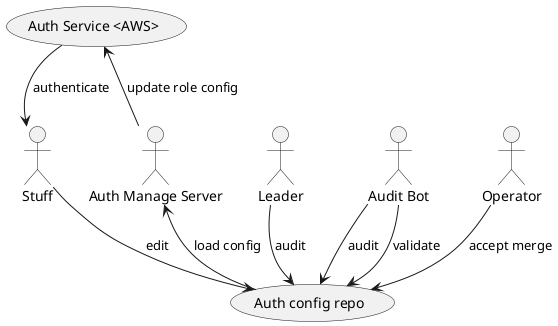
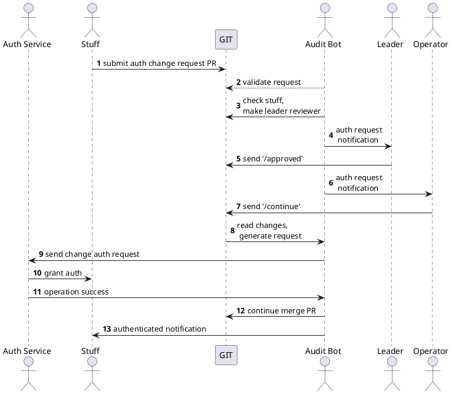

# \[WIP] Git Based Auth Manager (GBAM)

A small and clear auth management method for developer team.

## prototype

### The role of git in GBAM

The git repo is used to save auth configs, accept PR (auth request). All requests are
transparent and auditable. All operations of a single auth request are within single
PR.

### Audit bot

Audit bot is the core character of GBAM. It:
- validates auth request config
- check stuff relationships and send review request to stuff's leader
- collect leader's `approved` message
- send final check request to operator
- collect operator's `continue` message
- submit changes to auth service (like AWS)
    - if failed, bot will send message to the PR and waiting for next commit 
- merge request PR

